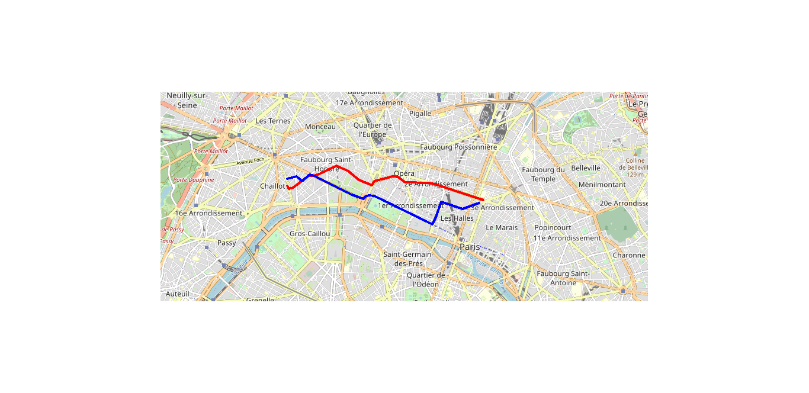
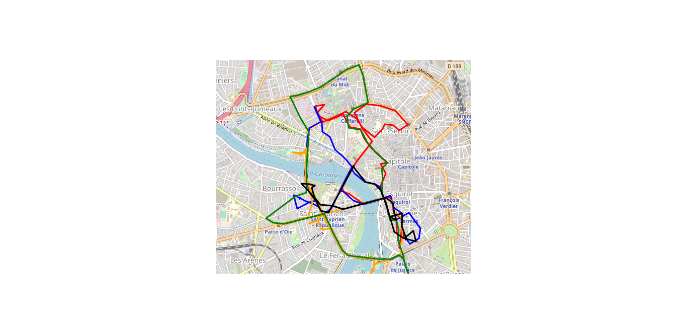

# Test technique ERCOM: détection de convois
#### Les jeux de données représentent les positions d’une flotte d’une centaine de véhicules durant cinq jours, du 1er au 5 Mai 2019 :
 
 §  ID : Identifiant du véhicule
 §  Lat : Latitude
 §  Long : Longitude
 §  Timestamp : Timestamp Epoch Unix
 
Remarque : Lorsqu’un véhicule se déplace, on dispose d’un point toutes les dix secondes. Lorsqu’il est à l’arrêt, on dispose d’un point toutes les 40 secondes en moyenne.
 
Questions :
 
 1.       Quelles sont les étapes du trajet du véhicule n°78 lors de la journée du 2 mai?
 2.       Quel est, à priori, le garage principal du véhicule n°57?
 3.       Si N véhicules (N>1) se déplacent ensemble sur une distance plus ou moins longue la même journée, ils forment un convoi. Identifiez les convois de la journée du 4 mai.
 4.       Identifiez le couple de véhicules formant le plus souvent un convoi entre le 1er et le 5 mai.
 
Nous attendons :
 
 1.       Un document R Markdown (ou bien un Jupyter Notebook) qui contiendra les questions ainsi que vos analyses pour y répondre. Vos réponses devront être commentées et argumentées.
 2.       Un moyen de reproduire votre environnement de travail afin de pouvoir rejouer facilement votre code (un fichier yml pour Python ou bien la liste des packages pour R).

# Question 1. : graphe des trajets avec vitesse élevées

# Question 2. : trajets pour chaque jour du véhicule n°57

# Question 2. : localisation du garage principal du véhicule n°57

# Auteur
 * Vincent Gigliobianco : https://www.linkedin.com/in/vincent-gigliobianco-4b45a9a8/
 
